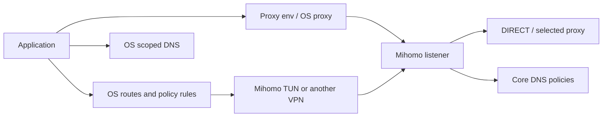

# TUN、Tailscale 與其他 VPN 共存

TUN、system proxy 和 shell proxy env 位於不同層。啟用其中一項不代表其他應用都走同一路徑；
DIRECT 表示核心選擇 direct outbound，也不等於主機上不存在另一個 VPN。



## 被動診斷

```sh
lazyclash diagnostics network
lazyclash --ssh home-server diagnostics network --json
lazyclash --target desktop --read-only diagnostics network --json
```

未指定 target／SSH 時檢查本機，不沿用可能在遠端的預設 target。指定 target 時，另讀取
該 core 的 TUN 狀態。報告包含介面、IPv4／IPv6 路由、Linux policy routing、scoped DNS、
Tailscale 狀態與 VPN 程序跡象；不修改網路或發送網站測試。

- **confirmed**：直接讀到的設定／路由，例如 exit node 或 tunnel 的全流量路由。
- **probable**：例如 SafeConnect、OpenVPN、SSLVPN 相關程序存在，仍需結合路由／DNS。
- **unknown**：工具缺失、權限不足、無法判定的狀態；不能把空資料視為沒有衝突。

macOS interface-scoped default route 不直接當成全系統 default route。Linux 除主表外也
檢查 policy rules；`0.0.0.0/1`＋`128.0.0.0/1` 等廣域路由同樣需要注意。

## Tailscale split routing

一般 tailnet／subnet 模式可以提議排除 `100.64.0.0/10`、`fd7a:115c:a1e0::/48`，以及
實際接受的 subnet routes。遠端管理連線的目的地也列入預覽。只排除固定 tailnet 網段
無法涵蓋透過 subnet router 存取的企業／家庭網路。

MagicDNS 是另一層：保留 tailnet suffix 與 Quad100 resolver 的對應，必要時加入核心
`nameserver-policy` 與 fake-IP exclusions。Mihomo 的 POSIX `system` resolver 讀取
`/etc/resolv.conf`，不能宣稱完整繼承 macOS scoped DNS 或 systemd-resolved split DNS。

Setup 分開顯示 route exclusions、核心 DIRECT 規則、DNS policy 和 system-proxy bypass。
`exclude-interface` 不是所有平台通用的 VPN 程序排除開關；尤其不能只靠介面名稱推斷出站行為。

## Exit node 為何會衝突

Tailscale exit node 將一般 Internet 流量導入 tailnet；Mihomo `auto-route` 也想接管廣域流量。
兩者可能競爭預設路由、policy routing、DNS 及 firewall，造成循環、繞過預期核心，或
使某一方看不到流量。Tailscale 官方明確表示一般 split-tunnel exclusion 的 workaround
不適用於 exit-node 模式。[官方共存說明](https://tailscale.com/docs/reference/faq/other-vpns)

本版要求先選擇預設路由的管理者：保留其他全流量 VPN 並使用 Mihomo explicit proxy，
或由使用者在原生 VPN 中調整模式後重新檢查。工具不自動停用企業 VPN，也不宣稱
已支援雙全流量 VPN 串接。其他 VPN 的 kill switch／管理政策可能有額外限制。

## 權限、服務與復原

macOS native TUN 使用 LaunchDaemon；Linux native 使用 systemd system service。
Linux rootful Docker 可用 host namespace、TUN device 與必要 capability；rootless Docker
及 macOS Docker Desktop 不提供主機 TUN setup，應選 native backend。

已有 Clash Verge service／TUN 時，先在該 owner 中管理；單純 API toggle 不會替它
安裝系統服務。Setup 不在同一主機啟動第二個已知衝突的 Mihomo TUN。

共存 preset 採 `auto-route=true`、`auto-redirect=false`、`strict-route=false`。
這不是 kill switch，也不保證零 DNS leak。Starter 的地區分類不代表 DNS 沒受干擾；
使用 URL diagnosis 分別查看 OS／core／proxy 的解析與路由證據。

網路啟用前會建立主機端 recovery snapshot 與 rollback deadline，並在新的 SSH 管理
連線及 API 驗證後 ACK。失去連線時 worker 仍可執行；遇到後續外部編輯則保留 snapshot
並回報衝突，不覆蓋新狀態。System proxy 的修改及還原以選定服務為範圍；GNOME 設定
必須在原使用者 desktop session 執行，不能用 root 的 gsettings 代替。

其他依據：[Mihomo TUN](https://wiki.metacubex.one/config/inbound/tun/)、
[Tailscale DNS](https://tailscale.com/docs/reference/dns-in-tailscale)、
[Mihomo system resolver](https://github.com/MetaCubeX/mihomo/blob/v1.19.31/dns/system_posix.go)、
[Docker host network](https://docs.docker.com/engine/network/drivers/host/)。
